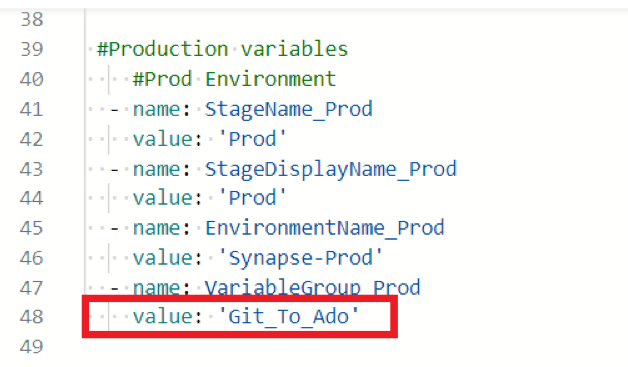
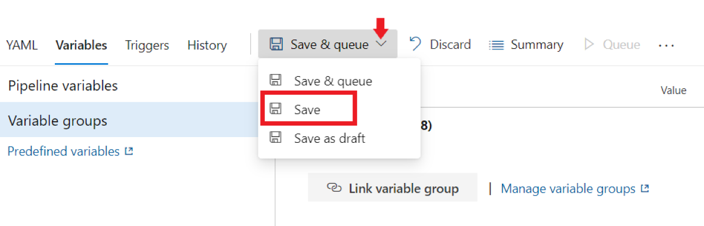

# *WPA Framework Handbook*

## *Prerequisites* : 
 - Azure Subscription with a Resource Group to deploy
 - Workplace Analytics(WPA) application must be availble under the Tenant and user need to have access to WPA
 - An Azure DevOps account with Organization name and Project name configured
 - Users must be added to the AD group which has owner access to the resource group
 - Users need to have contributor access to this Github Repo
 - Users should have O365 Admin credentials

**Contents**
<!-- TOC -->
- [Task 1: Cloning Git Repository To ADO](#cloning-git-repository-to-ado)
- [Task 2: Generating Personal Access Token(PAT)](#generating-personal-access-token)
- [Task 3: Creating Service Connection](#creating-service-connection)
- [Task 4: WPA Configurations for Extractions](#wpa-conf-extraction)
  - [Configure WPA API Permission](#configure-permission)
  - [OData Query and Link for extraction using synapse pipeline](#odata-query-extraction)
  - [Upload Employee Mapping File for WPA-Organization attribute mapping file](#employee-mapping)
- [Task 5: Running Pipelines](#running-pipelines)
  - [Install Synapse Workspace Deployment Extension](#install-synapse-workspace-deployment-extension)
  - [SIP Framework Variables](#sip-framework-variables)
    - [Variable Details](#variable-details) 
  - [SIP Framework Infra](#sip-framework-infra)
  - [SIP Framework Code](#sip-framework-code) 
<!-- /TOC -->

***

<a name="cloning-git-repository-to-ado"/>

## *Cloning Git Repository To ADO*

***

<a name="generating-personal-access-token"/>

## *Generating Personal Access Token(PAT)*

Click User Settings and select Personal Access Tokens

Click new Token and enter the name, check the organization name is reflecting correct, set the expiration date and select scopes as Full Access and then click on create

Remember to copy the name and pat key and paste it in notepad as it’s visible for one time only and it will be used during updation of library variables

***

<a name="creating-service-connection"/>

## *Creating Service Connection*

Once organization and project are created, then service connection needs to be created

- Go to Project Settings

- Click service connection and then click New service connection and select Azure Resource Manage and then select Service Principal(automatic) and click next

  

- Select the option Subscription, azure subscription and then the resource group under that subscription, then give proper service connection name and then save

- Once created, need to map that connection with the resource group. For that go under the service connection, click manage service principal and copy the name

- DevOps Secret Creation

- After copying the service principal display name, go to the resource group, select Access control(IAM), then click Add and select Add role assignment and then paste the copied name under select field, select Role as “Owner” and save

***

<a name="wpa-conf-extraction"/>

## *WPA Configurations for Extraction*

<a name="configure-permission"/>

### Configure WPA API Permission

   -  Go to App Registrations 
   
          
	
   -  Select the Service principal created for Service connection
   
         
	
   -  Choose API Permissions 
   
          
	
   -  Click Add a Permission > API my organization uses > Select Workplace Analytics 
   
         
	
   -  Click Application permissions > Select Analyst > Add Permissions
   
           
	
   -  Now the request for Analyst access is submitted. The user need to be provided with require permission -
     
   * To grant permission click Enterprise Applications
       
   
       
   * Click Grant admin consent for …
   
   
   
   * Login using O365 Admin id, click Accept

   

   * Now the id is ready to connect to WPA

***

<a name="odata-query-extraction"/>

### OData Query and Link for extraction using synapse pipeline

- Login to https://workplaceanalytics.office.com
- Use Analyst user
- Navigate to Analyze -> Query
 
    

###### If you want to extract the link of previously extracted query, follow below step
- Click Results to see the previously extracted query
- Click copy link

   
 
###### If you want to create new Query, follow below step

- Click New Query

   

- Click Ways of working tracker

   
   
- Select Attributes and Conditions as required

- Click Submit, this will get the query executed in the background. You can check the result after some time
 
***

<a name="employee-mapping"/>

### Upload Employee Mapping File for WPA-Organization attribute mapping file

- Navigate to https://workplaceanalytics.office.com
- Login using Admin Account
- Navigate to Settings -> Upload

   

- Click New Upload

   

- Click Select File

   

- Click Next
 
   

- Click Submit to process the file

***
<a name="running-pipelines"/>

## *Running Pipelines*

<a name="install-synapse-workspace-deployment-extension"/>

#### Install Synapse Workspace Deployment Extension

  - Go to Market place and type synapse workspace deployment extension
    
    
    
    
    
  - Click "Get if free"
  
    

  - Select "Organization" from dropdown and click install

    
    
*** 

<a name="sip-framework-variables"/>

#### SIP Framework Variables

  - Go To pipelines in ADO -> click new pipeline -> select Azure Repos Git
    
    
    
  - Then select the repository
    
    
    
  - Select “Existing Azure Pipelines YAML  file”. Select the branch from the dropdown and path of the yaml file and then continue
    
    

  - In the review phase, click on “variables” and the click “New Variables”
    
    
    
  - Now 4 variables needs to be created whose values will be passed as parameters. Remember to tick mark the “Let users override this value when running this pipeline” while         creating the variables
  
    | Variable Name | Description |
    |---------------|-------------|
    | DEVOPS_USER_PAT | PAT key which were copied in above step |
    | DEVOPS_ORG | From ADO, Mention the organization name in the value field  |
    | DEVOPS_PROJECT | From ADO, Mention the project name in the value field  |
    
      
  
  - After click the dropdown and save
    
    
  
  - Select Run pipeline and then Run
  
    
    
  - Following the Step,  “Variable Group” will be created which will contain all the list of necessary variables
		and will be seen under Pipelines -> Library -> VariableGroupName
  
    
    
  - Click the variable group and fill the variable accordingly  

***
<a name="variable-details"/>

## Variable Details

#### Populate Variables In Variable Group - Azure Portal : These variables needs to be populated in variable group from azure portal

| Variable Name		       | Description	             					    | How to Get			      |
|----------------------------- | -------------------------------------------------------------------|------------------------------------------
|AzureActiveDirectoryTenantID | Unique identifier (Tenant ID) of the Azure Active Directory instance | Azure portal -> Azure Active Directory -> Copy TenantId |
|AzureServiceConnectionName | Service connection name using which the deployment has to be done | ADO -> Project Settings -> Service Connection -> Copy Service Connection Name |
|ContributorADGroupObjectID | Object ID of contributor AD group to which Storage blob contributor access is provided | Azure portal -> Azure Active Directory -> groups -> Select AD group -> Copy Object Id |
|DevOpsApplicationClientID | DevOps Service Principal Application (client) ID. This is used to generate Bearer Token to invoke Synapse role assignment REST APIs. Note: It is not the Client Secret ID | ADO Project Settings -> Service Connection ->  Select Service Connection -> Manage Service Pricipal -> Copy Application (client) ID |
|DevOpsApplicationClientSecret | DevOps Service Principal Application Client Secret Value. This is used generating Bearer Token to invoke Synapse role assignment REST APIs | refer Creating Service Connection |
|LinkToADOPassword | ADO Password (PAT Key -> Needs to be saved while generating)| refer Generating Personal Access Token |
|LinkToADOUserName | ADO Username | Personal Access Token Name (refer Generating Personal Access Token) |
|LinkToGitPassword | git repo is part of same ADO project, same ADO Password can be used | same value as LinkToADOPassword |
|LinkToGitUserName | git repo is part of same ADO project, same ADO Password can be used| Personal Access Token Name (refer Generating Personal Access Token) |
|ResourceGroupName | Resource Group name where the deployment to be made | Azure Portal -> Copy Resource Group Name |
|SqlPoolAdminObjectID |	Object ID of a valid user or security-enabled group (Eg: Azure-Synapse-Spark-Admins) in Azure Active Directory | Same value as ContributorADGroupObjectID |
|SubscriptionId | Subscription Id where the deployment has to be done | Azure Portal -> Subscriptions ->  Select the subscription Name -> Copy Subscription ID |
|SynapseSqlActiveDirectoryAdminObjectId | | Same value as ContributorADGroupObjectID |
|SynapseWorkspaceAdminObjectID | Object ID of a valid user or security-enabled group (Eg: Azure-Synapse-WS-Admins) in Azure Active Directory | Same value as ContributorADGroupObjectID |
|WPA_Properties_aadResourceId | WPA Resource Id	| Paste https://workplaceanalytics.office.com in value field |	
|WPA_Properties_url | WPA URL | workplaceanalytics.office.com -> Analyze ->Queries -> Results -> select url from copy link. ex - https://workplaceanalytics.office.com/4fed98a0-18c6-43bf-add5-f9681f5a1a1f/scopes/bd723c2e-05bd-4232-b30a-4d7ba5e3921f/jobsodata/e31a6b99-33af-4446-88f7-0e0b6ac3a2e2/Person |

#### Populate Variables In Variable Group - Manual Entry : These variables needs to be manually entered in variable group with proper name 

| Variable Name		       | Description							    | 
|----------------------------- | -------------------------------------------------------------------|
|LinkToADOUrl | URL Format - https://analytics.dev.azure.com/{Organisation Name}/{Project Name}/_odata/v3.0-preview/ | 
|LinkToGitUrl | URL Format - https://dev.azure.com/{Organisation Name}/{Project Name}/_apis/git/repositories/{Repository Name}/commits?api-version=6|	
|MasterKeyPassword | Please provide the standard password which contain letters, numbers and special caharacter. For ex - Passw0rd@123 |
|powerBITenantID | Power BI Tenant Id |
|powerBIWorkspaceID | Power BI Workspace Id |
|SqlPoolName | SQL pool name should not match special patterns. The value has a length of at most 15. SQL pool name should not contain reserved words. No SQL pool with the same name exists in the workspace |
|SyanpseDefaultADLSFileSystemName | Dafualt ADLS Container name to be linked with Syanpse |
|SyanpseDefaultADLSName | Default ADLS Storage account name to be linked with Synapse |
|SynapseSqlAdministratorLoginPassword |	Your password must be between 8 and 128 characters long. Your password must contain characters from three of the following categories – English uppercase letters, English lowercase letters, numbers (0-9), and non-alphanumeric characters (!, $, #, %, etc.). Your password cannot contain all or part of the login name. Part of a login name is defined as three or more consecutive alphanumeric characters |
|SynapseWorkspaceName |	Synapse workspace name. No dashes allowed |
|SynapseSqlActiveDirectoryAdminName | Contributor AD Group Name	|
	

#### Predefined Variables : These variables will be predefined

| Variable Name		       | Description 	   						    | 
|----------------------------- | -------------------------------------------------------------------|
|ResourceGroupLocation | Location Resource Group where the deployment to be made | Azure Portal -> Resource Group -> Copy Location |
|SourceADLSContainerName | Data Lake Container name	|
|SqlPoolCollation |	Collation defines the rules that sort and compare data, and cannot be changed after SQL pool creation. The default collation is SQL_Latin1_General_CP1_CI_AS |
|SqlPoolLocation |	Resource location, keep it same as workspace |
|SqlPoolSku |	Choose a SQL pool performance level that best fits your analytics needs |
|SqlPoolTags |	Resource Tags |
|SynapseAllowAllConnections |	To enable all IP address to access Synapse workspace. This has to be set as true to enable REST API calls for synapse role assignment in the pipeline. If the IP access has to be restricted, update the firewall setting in synapse workspace after deployment to allow specific IP range |
|SynapseGrantWorkspaceIdentityControlForSql |	To grant workspace identity control for SQL |
|SynapseIsNewFileSystemOnly |	true if the storage account exists and container has to be created. Otherwise false |
|SynapseIsNewStorageAccount |	true if the storage account has to be created. else false. If this is true, above parameter should be false |
|SynapseLocation |	Synapse workspace location |
|SynapseManagedVirtualNetwork |	Choose this option to ensure that connections from your workspace to your data sources use Azure Private Links. Leave this field blank if Azure Private Link is not required, the pipeline is only tested for this scenario |
|SynapseSetUserRbacOnStorageAccount |	true if the storage account "Storage Blob Data Contributor" access to be provided to a user in addition to Synapse workspace managed identity, else false. If this is set as true, SynapseStorageAccountAccessUserObjectID is mandatory |
|SynapseSqlAdministratorLogin |	SQL Pool Admin User name |
|SynapseStorageAccessTier | StorageAccessTier |
|SynapseStorageAccountAccessUserObjectID | Object id of a valid user in Azure Active directory whom the storage account "Storage Blob Data Contributor" access to be provided in addition to Synapse workspace managed identity. Applicable only if SynapseSetUserRbacOnStorageAccount is set to ture |
|SynapseStorageAccountType | StorageAccountType |
|SynapseStorageIsHnsEnabled | Is HierarchicalNamespace enabled |
|SynapseStorageKind | StorageKind |
|SynapseStorageLocation | Storage location |
|SynapseStorageSupportsHttpsTrafficOnly | SupportsHttpsTrafficOnly |
|SynapseWorkspaceIdentityRbacOnStorageAccount |	Assign "Storage Blob Data Contributor" role to workspace managed identity. Should be set it as true |
|SynapseWorkspaceTags |	Resource tags |

***

<a name="sip-framework-infra"/>

#### SIP Framework Infra
	
  - Go To pipelines in ADO -> click new pipeline -> select Azure Repos Git
  	
     
	
  - Select the repository
    
     
    
  - Select “Existing Azure Pipelines YAML  file”. Select branch from the dropdown and path of the yaml file and then continue
     
     
     
  - Now copy the Variable Group Name and update those with Variable Group Name in the Review Phase at 3 places then click save from the dropdown
  
         
  
  - Now we have to link the Variable group with the pipeline. For that Click “Edit” and then go to more actions and select triggers
     
       
     
  - Then select Variable -> Variable Groups -> Link variable group -> select your variable group -> Link
     
     
     
  - Once Linked, click save from dropdown and run the pipeline
     
     
     
     
     
  - After the pipeline has ran successfully, go to portal.azure.com and check under resouce group whether the resources has been created or not. 3 resources will get created – 
    - Storage Account
    - Dedicated SqlPool
    - Synapse Workspace

    

<a name="sip-framework-code"/>

#### SIP Framework Code

   - Now go To pipelines in ADO -> click new pipeline -> select Azure Repos Git
   
       
   
   - Select the repository
   
        
   
   - Select “Existing Azure Pipelines YAML  file”. Select branch from the dropdown and path of the yaml file and then continue

	 

   - Here also in Review phase need to update the variable group name and then save it

	     

   - Now link the Variable group with the pipeline. For that Click “Edit” and then go to more actions and select triggers

	   

   - Then select Variable -> Variable Groups -> Link variable group -> select your variable group -> Link

	 

   - Once Linked, click save from dropdown and run the pipeline

	   

   - After the pipeline has ran successfully, go to portal.azure.com -> your Resource group -> synapse workspace then check whether all adf pipelines and linked services created 	or not

	       

   - Now before running the ADF pipelines, go to portal.azure.com -> your storage account -> your container -> Landin -> wpa and under this location, upload the wpa.csv file and 	then run the adf pipelines
 
  - ADF pipeline runs in the given order -
    - Load WPA Extract
    - ProcessADOData(After successfully completing the first one)
